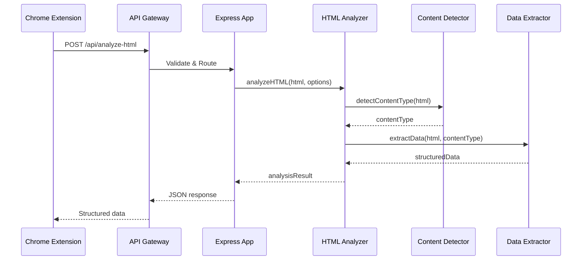
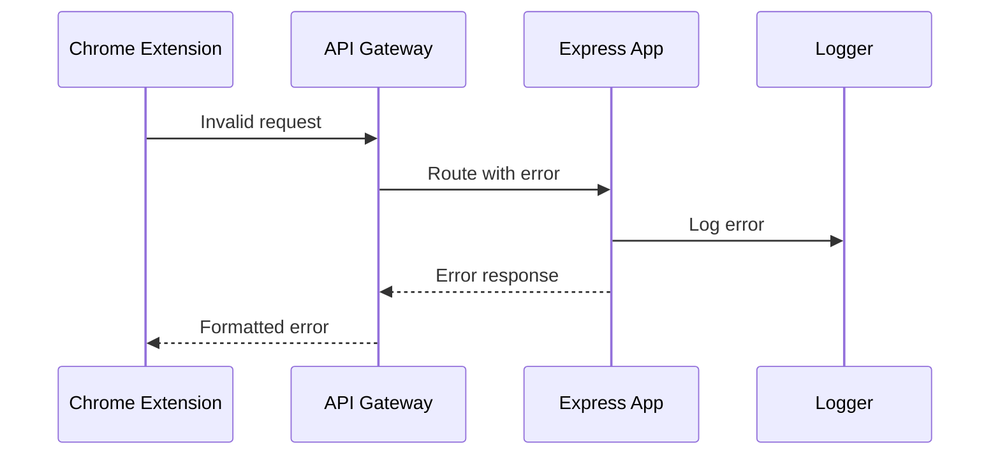

# Travel Offer API - Документация

## Обзор

Travel Offer API - это REST API сервис для анализа HTML контента, выбранного пользователем в расширении Travel Offer Assistant. Сервис извлекает структурированные данные из веб-страниц и предоставляет удобную сводку информации об отелях, авиабилетах, трансферах и других туристических предложениях.

## Структура документации

### 📄 [Обзор документации](./README.md)
- Обзор документации
- Общее описание проекта
- Основные разделы

### 🔌 [API Документация](./api/)
- [Обзор API](./api/README.md)
- [Endpoints](./api/endpoints.md)
- [Авторизация](./api/authentication.md)
- [Обработка ошибок](./api/error-handling.md)
- [Примеры использования](./api/examples.md)

### 🏗️ [Архитектура](./architecture/)
- [Обзор архитектуры](./architecture/README.md)
- [Системный дизайн](./architecture/system-design.md)
- [Потоки данных](./architecture/data-flow.md)
- [Безопасность](./architecture/security.md)

### ‍💻 [Разработка](./development/)
- [Руководство разработчика](./development/README.md)
- [Настройка окружения](./development/setup.md)
- [Стандарты кодирования](./development/coding-standards.md)
- [Тестирование](./development/testing.md)
- [Развертывание](./development/deployment.md)

### 🔗 [Интеграция](./integration/)
- [Обзор интеграции](./integration/README.md)
- [Интеграция с расширением](./integration/extension-integration.md)
- [API клиент](./integration/api-client.md)

### 🔧 [Обслуживание](./maintenance/)
- [Обзор обслуживания](./maintenance/README.md)
- [Мониторинг](./maintenance/monitoring.md)
- [Устранение неполадок](./maintenance/troubleshooting.md)
- [Обновления](./maintenance/updates.md)

## Быстрый старт

1. [Настройка окружения](./development/setup.md)
2. [Обзор API](./api/README.md)
3. [Примеры использования](./api/examples.md)

## Контакты

- **Репозиторий**: [travel-offer-api](https://github.com/your-org/travel-offer-api)
- **Issues**: [GitHub Issues](https://github.com/your-org/travel-offer-api/issues)
- **Документация**: [API Docs](./api/README.md)

### 1. `docs/README.md` - Обзор документации

```markdown
# Travel Offer API - Документация

## Обзор

Travel Offer API - это REST API сервис для анализа HTML контента, выбранного пользователем в расширении Travel Offer Assistant. Сервис извлекает структурированные данные из веб-страниц и предоставляет удобную сводку информации об отелях, авиабилетах, трансферах и других туристических предложениях.

## Структура документации

### 📄 [Обзор проекта](./project-overview.md)
- Назначение и цели проекта
- Основные функции
- Технологический стек

### 🔌 [API Документация](./api/)
- [Обзор API](./api/README.md)
- [Endpoints](./api/endpoints.md)
- [Авторизация](./api/authentication.md)
- [Обработка ошибок](./api/error-handling.md)
- [Примеры использования](./api/examples.md)

### 🏗️ [Архитектура](./architecture/)
- [Обзор архитектуры](./architecture/README.md)
- [Системный дизайн](./architecture/system-design.md)
- [Потоки данных](./architecture/data-flow.md)
- [Безопасность](./architecture/security.md)

### ‍💻 [Разработка](./development/)
- [Руководство разработчика](./development/README.md)
- [Настройка окружения](./development/setup.md)
- [Стандарты кодирования](./development/coding-standards.md)
- [Тестирование](./development/testing.md)
- [Развертывание](./development/deployment.md)

### 🔗 [Интеграция](./integration/)
- [Обзор интеграции](./integration/README.md)
- [Интеграция с расширением](./integration/extension-integration.md)
- [API клиент](./integration/api-client.md)

### 🔧 [Обслуживание](./maintenance/)
- [Обзор обслуживания](./maintenance/README.md)
- [Мониторинг](./maintenance/monitoring.md)
- [Устранение неполадок](./maintenance/troubleshooting.md)
- [Обновления](./maintenance/updates.md)

## Быстрый старт

1. [Настройка окружения](./development/setup.md)
2. [Обзор API](./api/README.md)
3. [Примеры использования](./api/examples.md)

## Контакты

- **Репозиторий**: [travel-offer-api](https://github.com/your-org/travel-offer-api)
- **Issues**: [GitHub Issues](https://github.com/your-org/travel-offer-api/issues)
- **Документация**: [API Docs](./api/README.md)
```

### 2. `docs/project-overview.md` - Общее описание проекта

```markdown
# Обзор проекта Travel Offer API

## Назначение

Travel Offer API - это специализированный REST API сервис, разработанный для расширения Travel Offer Assistant. Основная задача сервиса - анализ HTML контента, выбранного пользователем на веб-страницах, и извлечение структурированных данных о туристических предложениях.

## Проблема

При планировании путешествий пользователи часто сталкиваются с необходимостью:
- Собирать информацию с множества сайтов
- Сравнивать предложения вручную
- Структурировать найденную информацию
- Принимать решения на основе разрозненных данных

## Решение

API предоставляет автоматизированный анализ HTML контента для:
- **Извлечения ключевых данных**: цены, названия, описания, изображения
- **Определения типа контента**: отели, авиабилеты, трансферы, общая информация
- **Структурирования информации**: удобный формат для сравнения и анализа
- **Повышения эффективности**: автоматизация рутинных задач

## Основные функции

### 🔍 Анализ контента
- Парсинг HTML элементов
- Извлечение текстового контента
- Обработка изображений
- Определение структуры данных

### 📊 Классификация контента
- **Отели**: названия, цены, рейтинги, удобства, локации
- **Авиабилеты**: рейсы, даты, авиакомпании, цены, маршруты
- **Трансферы**: типы транспорта, маршруты, цены, время
- **Общая информация**: описания, контакты, детали

### 📊 Структурированный вывод
- JSON формат с четкой структурой
- Уровень уверенности в результатах
- Метаданные обработки
- Предложения по улучшению

## Технологический стек

### Backend
- **Node.js** - среда выполнения
- **Express.js** - веб-фреймворк
- **JWT** - авторизация
- **Joi** - валидация данных

### HTML Processing
- **Cheerio** - серверный jQuery для парсинга
- **JSDOM** - DOM эмуляция
- **CSS Selectors** - извлечение данных

### Безопасность
- **Helmet.js** - HTTP заголовки безопасности
- **CORS** - настройки кросс-доменных запросов
- **Rate Limiting** - ограничение запросов
- **Input Sanitization** - очистка входных данных

### Инфраструктура
- **Winston** - логирование
- **Jest** - тестирование
- **Docker** - контейнеризация
- **CI/CD** - автоматизация развертывания

## Архитектурные принципы

### Микросервисная архитектура
- Независимый сервис
- Четкие границы ответственности
- Масштабируемость
- Простота развертывания

### REST API
- Стандартные HTTP методы
- JSON формат данных
- Статус коды ошибок
- Версионирование API

### Безопасность
- JWT токены для авторизации
- Валидация всех входных данных
- Защита от атак
- Логирование безопасности

## Целевая аудитория

### Основные пользователи
- **Разработчики расширения** - интеграция с API
- **Пользователи расширения** - анализ контента
- **Администраторы** - мониторинг и обслуживание

### Интеграции
- **Chrome Extension** - основной клиент
- **Веб-сайты** - потенциальные партнеры
- **Мобильные приложения** - будущие клиенты

## Метрики успеха

### Технические метрики
- Время отклика API < 500ms
- Доступность сервиса > 99.9%
- Точность анализа > 90%
- Покрытие тестами > 80%

### Бизнес метрики
- Количество обработанных запросов
- Удовлетворенность пользователей
- Время экономии пользователей
- Конверсия в покупки

## Дорожная карта

### Phase 1: MVP (1-2 недели)
- [x] Базовая архитектура
- [x] Основной endpoint
- [x] Простой анализ HTML
- [x] JWT авторизация

### Phase 2: Улучшения (1 неделя)
- [ ] Продвинутый анализ контента
- [ ] Извлечение изображений
- [ ] Определение типов контента
- [ ] Улучшенная валидация

### Phase 3: Оптимизация (1 неделя)
- [ ] Кэширование результатов
- [ ] Performance оптимизация
- [ ] Расширенное логирование
- [ ] Мониторинг

### Phase 4: Production (1 неделя)
- [ ] Docker контейнеризация
- [ ] CI/CD pipeline
- [ ] Production деплой
- [ ] Документация

## Заключение

Travel Offer API решает реальную проблему пользователей, автоматизируя анализ туристического контента и предоставляя структурированную информацию для принятия решений. Проект построен на современных технологиях с учетом безопасности, масштабируемости и удобства использования.
```

### 3. `docs/api/README.md` - Обзор API

```markdown
# API Документация

## Обзор

Travel Offer API предоставляет RESTful интерфейс для анализа HTML контента и извлечения структурированных данных о туристических предложениях.

## Базовый URL

```
Production: https://api.travel-offer.com
Development: http://localhost:3000
```

## Аутентификация

API использует JWT токены для аутентификации. Все запросы (кроме health check) требуют валидный токен в заголовке `Authorization`.

```http
Authorization: Bearer <your-jwt-token>
```

## Формат ответов

### Успешный ответ
```json
{
  "success": true,
  "data": {
    // Данные ответа
  },
  "timestamp": "2024-01-15T10:30:00Z"
}
```

### Ответ с ошибкой
```json
{
  "success": false,
  "error": {
    "code": "ERROR_CODE",
    "message": "Описание ошибки",
    "details": {
      // Дополнительные детали
    }
  },
  "timestamp": "2024-01-15T10:30:00Z"
}
```

## Endpoints

### Основные endpoints

| Метод | Endpoint | Описание |
|-------|----------|----------|
| `POST` | `/api/analyze-html` | Анализ HTML контента |
| `GET` | `/api/health` | Проверка состояния сервиса |
| `GET` | `/api/status` | Статус и метрики |

### Дополнительные endpoints

| Метод | Endpoint | Описание |
|-------|----------|----------|
| `POST` | `/api/auth/login` | Получение JWT токена |
| `POST` | `/api/auth/refresh` | Обновление токена |
| `GET` | `/api/metrics` | Метрики производительности |

## Коды ошибок

| Код | Описание |
|-----|----------|
| `VALIDATION_ERROR` | Ошибка валидации входных данных |
| `AUTHENTICATION_ERROR` | Ошибка аутентификации |
| `AUTHORIZATION_ERROR` | Ошибка авторизации |
| `RATE_LIMIT_EXCEEDED` | Превышен лимит запросов |
| `PROCESSING_ERROR` | Ошибка обработки данных |
| `INTERNAL_ERROR` | Внутренняя ошибка сервера |

## Rate Limiting

API использует ограничение запросов для предотвращения злоупотреблений:

- **100 запросов** в течение **15 минут** на IP адрес
- **1000 запросов** в течение **1 часа** на JWT токен

При превышении лимита возвращается ошибка `RATE_LIMIT_EXCEEDED`.

## Версионирование

API использует семантическое версионирование. Текущая версия: `v1.0.0`

Версия указывается в заголовке запроса:
```http
Accept: application/vnd.travel-offer.v1+json
```

## Поддержка

- **Документация**: [Полная документация API](./endpoints.md)
- **Примеры**: [Примеры использования](./examples.md)
- **Ошибки**: [Обработка ошибок](./error-handling.md)
- **Безопасность**: [Авторизация и безопасность](./authentication.md)
```

### 4. `docs/api/endpoints.md` - Детальное описание endpoints

```markdown
# API Endpoints

## POST /api/analyze-html

Анализирует HTML контент и извлекает структурированные данные о туристических предложениях.

### Запрос

#### Headers
```http
Content-Type: application/json
Authorization: Bearer <jwt-token>
```

#### Body
```json
{
  "html": "<div class='hotel-card'>...</div>",
  "url": "https://example.com/hotel",
  "context": "travel_offer",
  "options": {
    "extractImages": true,
    "extractPrices": true,
    "extractText": true,
    "maxElements": 100,
    "timeout": 30000
  }
}
```

#### Параметры

| Параметр | Тип | Обязательный | Описание |
|----------|-----|--------------|----------|
| `html` | string | ✅ | HTML контент для анализа |
| `url` | string | ❌ | URL страницы (для контекста) |
| `context` | string | ❌ | Контекст анализа (по умолчанию: "travel_offer") |
| `options.extractImages` | boolean | ❌ | Извлекать изображения (по умолчанию: true) |
| `options.extractPrices` | boolean | ❌ | Извлекать цены (по умолчанию: true) |
| `options.extractText` | boolean | ❌ | Извлекать текст (по умолчанию: true) |
| `options.maxElements` | number | ❌ | Максимум элементов для анализа (по умолчанию: 100) |
| `options.timeout` | number | ❌ | Таймаут обработки в мс (по умолчанию: 30000) |

### Ответ

#### Успешный ответ (200)
```json
{
  "success": true,
  "data": {
    "contentType": "hotel_card",
    "confidence": 0.95,
    "extractedData": {
      "hotelName": "Grand Hotel Paris",
      "price": "$150/night",
      "rating": "4.5",
      "location": "Paris, France",
      "description": "Luxury hotel in the heart of Paris...",
      "images": [
        {
          "src": "https://example.com/image.jpg",
          "alt": "Hotel exterior",
          "width": 300,
          "height": 200
        }
      ],
      "amenities": ["WiFi", "Pool", "Spa"],
      "contact": {
        "phone": "+33 1 23 45 67 89",
        "email": "info@grandhotel.com"
      }
    },
    "suggestions": [
      "Add more details about amenities",
      "Include cancellation policy"
    ],
    "metadata": {
      "processingTime": 150,
      "elementCount": 25,
      "textLength": 1200,
      "imageCount": 3
    }
  },
  "timestamp": "2024-01-15T10:30:00Z"
}
```

#### Типы контента

| Тип | Описание | Примеры данных |
|-----|----------|----------------|
| `hotel_card` | Карточка отеля | название, цена, рейтинг, локация |
| `flight_card` | Карточка авиабилета | рейс, даты, авиакомпания, цена |
| `transfer_card` | Карточка трансфера | маршрут, тип транспорта, цена |
| `generic_card` | Общая информация | описание, контакты, детали |

### Ошибки

#### 400 - Validation Error
```json
{
  "success": false,
  "error": {
    "code": "VALIDATION_ERROR",
    "message": "HTML content is required",
    "details": {
      "field": "html",
      "value": null
    }
  }
}
```

#### 401 - Authentication Error
```json
{
  "success": false,
  "error": {
    "code": "AUTHENTICATION_ERROR",
    "message": "Invalid or expired token"
  }
}
```

#### 429 - Rate Limit Exceeded
```json
{
  "success": false,
  "error": {
    "code": "RATE_LIMIT_EXCEEDED",
    "message": "Too many requests, please try again later",
    "details": {
      "retryAfter": 900
    }
  }
}
```

## GET /api/health

Проверяет состояние сервиса и его зависимостей.

### Запрос

```http
GET /api/health
```

### Ответ

#### 200 - Service Healthy
```json
{
  "success": true,
  "data": {
    "status": "healthy",
    "timestamp": "2024-01-15T10:30:00Z",
    "uptime": 86400,
    "version": "1.0.0",
    "environment": "production"
  }
}
```

#### 503 - Service Unhealthy
```json
{
  "success": false,
  "error": {
    "code": "SERVICE_UNAVAILABLE",
    "message": "Service is not healthy",
    "details": {
      "database": "connected",
      "memory": "low",
      "disk": "ok"
    }
  }
}
```

## GET /api/status

Возвращает детальную информацию о состоянии сервиса и метрики.

### Запрос

```http
GET /api/status
Authorization: Bearer <jwt-token>
```

### Ответ

```json
{
  "success": true,
  "data": {
    "status": "operational",
    "timestamp": "2024-01-15T10:30:00Z",
    "uptime": 86400,
    "version": "1.0.0",
    "environment": "production",
    "metrics": {
      "requests": {
        "total": 15000,
        "successful": 14850,
        "failed": 150,
        "rate": 10.5
      },
      "performance": {
        "averageResponseTime": 120,
        "p95ResponseTime": 250,
        "p99ResponseTime": 500
      },
      "errors": {
        "validation": 50,
        "authentication": 30,
        "processing": 70
      }
    },
    "system": {
      "memory": {
        "used": "512MB",
        "total": "1GB",
        "percentage": 50
      },
      "cpu": {
        "usage": 25.5
      },
      "disk": {
        "used": "2GB",
        "total": "10GB",
        "percentage": 20
      }
    }
  }
}
```

## POST /api/auth/login

Получение JWT токена для аутентификации.

### Запрос

```json
{
  "clientId": "extension-client-id",
  "clientSecret": "extension-client-secret"
}
```

### Ответ

```json
{
  "success": true,
  "data": {
    "token": "eyJhbGciOiJIUzI1NiIsInR5cCI6IkpXVCJ9...",
    "expiresIn": 86400,
    "tokenType": "Bearer"
  }
}
```

## POST /api/auth/refresh

Обновление JWT токена.

### Запрос

```http
Authorization: Bearer <current-jwt-token>
```

### Ответ

```json
{
  "success": true,
  "data": {
    "token": "eyJhbGciOiJIUzI1NiIsInR5cCI6IkpXVCJ9...",
    "expiresIn": 86400,
    "tokenType": "Bearer"
  }
}
```

## GET /api/metrics

Возвращает метрики производительности API.

### Запрос

```http
GET /api/metrics
Authorization: Bearer <jwt-token>
```

### Ответ

```json
{
  "success": true,
  "data": {
    "timestamp": "2024-01-15T10:30:00Z",
    "period": "24h",
    "requests": {
      "total": 15000,
      "byEndpoint": {
        "/api/analyze-html": 12000,
        "/api/health": 2000,
        "/api/status": 1000
      },
      "byStatus": {
        "200": 14850,
        "400": 100,
        "401": 30,
        "429": 20
      }
    },
    "performance": {
      "averageResponseTime": 120,
      "responseTimeDistribution": {
        "0-100ms": 8000,
        "100-500ms": 5000,
        "500ms+": 2000
      }
    },
    "errors": {
      "total": 150,
      "byType": {
        "validation": 50,
        "authentication": 30,
        "processing": 70
      }
    }
  }
}
```
```

### 5. `docs/architecture/README.md` - Обзор архитектуры

```markdown
# Архитектура Travel Offer API

## Обзор

Travel Offer API построен на принципах микросервисной архитектуры с четким разделением ответственности, высокой масштабируемостью и отказоустойчивостью.

## Архитектурные принципы

### 🏗️ Микросервисная архитектура
- **Независимость**: каждый компонент может развиваться отдельно
- **Изоляция**: отказы одного компонента не влияют на другие
- **Масштабируемость**: компоненты можно масштабировать независимо
- **Технологическая гибкость**: возможность использовать разные технологии

### 🔒 Безопасность
- **Defense in Depth**: многоуровневая защита
- **Principle of Least Privilege**: минимальные права доступа
- **Secure by Default**: безопасность по умолчанию
- **Continuous Security**: постоянный мониторинг безопасности

###  Производительность
- **Async Processing**: асинхронная обработка запросов
- **Caching**: кэширование результатов
- **Rate Limiting**: ограничение нагрузки
- **Resource Optimization**: оптимизация ресурсов

## Компоненты системы

###  API Gateway Layer
```
┌─────────────────┐
│   API Gateway   │ ← Rate Limiting, CORS, Auth
└─────────────────┘
```

**Ответственность:**
- Маршрутизация запросов
- Аутентификация и авторизация
- Rate limiting
- CORS настройки
- Логирование запросов

###  Application Layer
```
┌─────────────────┐
│   Express App   │ ← Request handling, routing
└─────────────────┘
         │
┌─────────────────┐
│   Middleware    │ ← Validation, auth, logging
└─────────────────┘
```

**Ответственность:**
- Обработка HTTP запросов
- Валидация входных данных
- Применение middleware
- Маршрутизация к сервисам

### 🧠 Business Logic Layer
```
┌─────────────────┐
│ HTML Analyzer   │ ← Основная логика анализа
└─────────────────┘
         │
┌─────────────────┐
│ Content Detector│ ← Определение типа контента
└─────────────────┘
         │
┌─────────────────┐
│ Data Extractor  │ ← Извлечение данных
└─────────────────┘
```

**Ответственность:**
- Анализ HTML контента
- Определение типа контента
- Извлечение структурированных данных
- Генерация предложений

### 🛠️ Infrastructure Layer
```
┌─────────────────┐
│   Logging       │ ← Winston logger
└─────────────────┘
         │
┌─────────────────┐
│   Monitoring    │ ← Health checks, metrics
└─────────────────┘
         │
┌─────────────────┐
│   Security      │ ← JWT, sanitization
└─────────────────┘
```

**Ответственность:**
- Логирование
- Мониторинг
- Безопасность
- Конфигурация

## Потоки данных

### 1. Анализ HTML контента



### 2. Обработка ошибок



## Технологический стек

### Backend Framework
- **Express.js**: веб-фреймворк для Node.js
- **Node.js**: среда выполнения JavaScript

### HTML Processing
- **Cheerio**: серверный jQuery для парсинга HTML
- **JSDOM**: DOM эмуляция для сложного анализа
- **CSS Selectors**: извлечение данных по селекторам

### Безопасность
- **JWT**: JSON Web Tokens для аутентификации
- **Helmet.js**: HTTP заголовки безопасности
- **CORS**: настройки кросс-доменных запросов
- **Rate Limiting**: ограничение количества запросов

### Валидация и обработка данных
- **Joi**: схема валидации данных
- **Sanitization**: очистка HTML от вредоносного кода
- **Input Validation**: проверка входных данных

### Логирование и мониторинг
- **Winston**: структурированное логирование
- **Health Checks**: проверка состояния сервиса
- **Metrics**: сбор метрик производительности

## Конфигурация

### Переменные окружения
```bash
# Основные настройки
NODE_ENV=production
PORT=3000

# JWT Configuration
JWT_SECRET=your-super-secret-jwt-key
JWT_EXPIRES_IN=24h

# Rate Limiting
RATE_LIMIT_WINDOW_MS=900000
RATE_LIMIT_MAX_REQUESTS=100

# CORS
ALLOWED_ORIGINS=https://chrome-extension://your-extension-id

# Logging
LOG_LEVEL=info
LOG_FILE=logs/app.log

# Processing
MAX_HTML_SIZE=1048576
PROCESSING_TIMEOUT=30000
```

### Структура конфигурации
```javascript
// config/environment.js
module.exports = {
  app: {
    port: process.env.PORT || 3000,
    environment: process.env.NODE_ENV || 'development'
  },
  jwt: {
    secret: process.env.JWT_SECRET,
    expiresIn: process.env.JWT_EXPIRES_IN || '24h'
  },
  rateLimit: {
    windowMs: parseInt(process.env.RATE_LIMIT_WINDOW_MS) || 900000,
    max: parseInt(process.env.RATE_LIMIT_MAX_REQUESTS) || 100
  },
  cors: {
    allowedOrigins: process.env.ALLOWED_ORIGINS?.split(',') || []
  },
  processing: {
    maxHtmlSize: parseInt(process.env.MAX_HTML_SIZE) || 1048576,
    timeout: parseInt(process.env.PROCESSING_TIMEOUT) || 30000
  }
};
```

## Масштабирование

### Горизонтальное масштабирование
- **Load Balancer**: распределение нагрузки между экземплярами
- **Stateless Design**: отсутствие состояния в приложении
- **Database Sharding**: разделение данных при необходимости
- **Caching Layer**: Redis для кэширования

### Вертикальное масштабирование
- **Resource Optimization**: оптимизация использования ресурсов
- **Memory Management**: управление памятью
- **CPU Optimization**: оптимизация процессорного времени
- **I/O Optimization**: оптимизация ввода/вывода

## Безопасность

### Аутентификация и авторизация
- **JWT Tokens**: безопасные токены доступа
- **Token Refresh**: автоматическое обновление токенов
- **Scope-based Access**: доступ на основе ролей
- **Token Blacklisting**: блокировка скомпрометированных токенов

### Защита данных
- **Input Sanitization**: очистка входных данных
- **Output Encoding**: кодирование выходных данных
- **HTTPS Only**: только защищенные соединения
- **Secure Headers**: безопасные HTTP заголовки

### Мониторинг безопасности
- **Security Logging**: логирование событий безопасности
- **Anomaly Detection**: обнаружение аномалий
- **Rate Limiting**: ограничение подозрительной активности
- **IP Blocking**: блокировка подозрительных IP

## Мониторинг и логирование

### Health Checks
- **Liveness Probe**: проверка жизнеспособности
- **Readiness Probe**: проверка готовности к работе
- **Startup Probe**: проверка запуска
- **Custom Health Checks**: пользовательские проверки

### Метрики
- **Request Metrics**: метрики запросов
- **Performance Metrics**: метрики производительности
- **Error Metrics**: метрики ошибок
- **Business Metrics**: бизнес метрики

### Логирование
- **Structured Logging**: структурированное логирование
- **Log Levels**: уровни логирования
- **Log Aggregation**: агрегация логов
- **Log Retention**: хранение логов

## Развертывание

### Контейнеризация
- **Docker**: контейнеризация приложения
- **Multi-stage Builds**: многоэтапная сборка
- **Image Optimization**: оптимизация образов
- **Security Scanning**: сканирование безопасности

### CI/CD Pipeline
- **Automated Testing**: автоматическое тестирование
- **Code Quality**: проверка качества кода
- **Security Scanning**: сканирование безопасности
- **Automated Deployment**: автоматическое развертывание

### Environment Management
- **Environment Variables**: переменные окружения
- **Configuration Management**: управление конфигурацией
- **Secrets Management**: управление секретами
- **Feature Flags**: флаги функций
```

Это основные файлы документации. Хотите, чтобы я продолжил с остальными файлами или есть какие-то конкретные разделы, которые вас больше интересуют?
